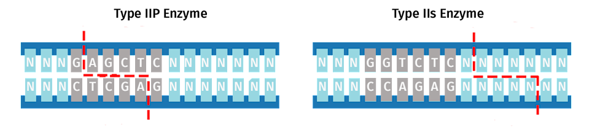
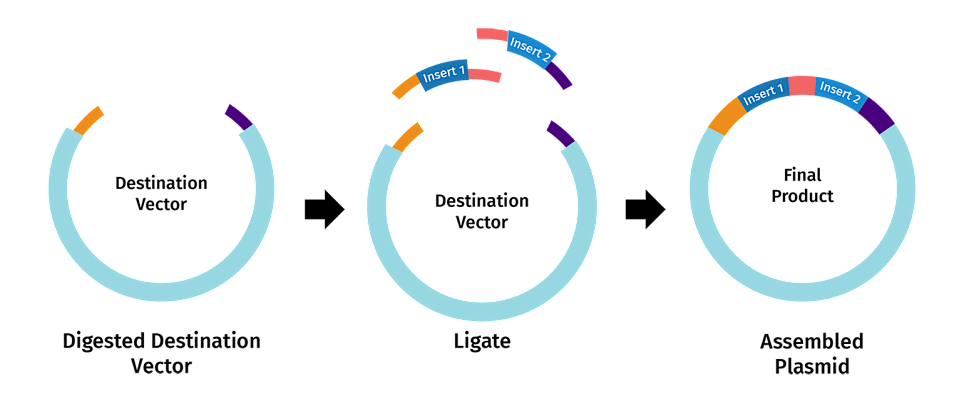

# CassetteCrafter
CassetteCrafter automates the creation of DNA sequence libraries containing all combinations of desired mutations, formatted for Golden Gate Assembly workflows.  

This software generates a library of DNA sequence cassettes that contain all possible combinations of specified mutations, with the necessary recognition sequences for Golden Gate Assembly. A user provided starting sequence is used to generate a library of mutant sequences. These sequences are then split into cassettes with optimized overhangs to fit oligo length requirements. The user chooses which Type IIs enzyme will be used for plasmid construction, and recognition sites are added onto the ends of each cassette. If neccessary, additional bases are added to meet length requirements.

For more information on cloning terminology and techniques, see [Traditional Cloning Basics from ThermoFisher](https://www.thermofisher.com/us/en/home/life-science/cloning/cloning-learning-center/invitrogen-school-of-molecular-biology/molecular-cloning/cloning/traditional-cloning-basics.html) 

## Project Structure

- `app_script.py`: Main Flask app script with routes and backend processing.
- `temp/`:
   - Data files
- `templates/`: 
  - `index.html`: Input page for user data.
  - `gg_assembly.html`: Information page.
  - `result.html`: Result page for optimized sequence download.
- `static/`: 
  - Images used in the html files.
- `Tests`: 
   - `test_app_script.py`: Result page for optimized sequence download.

## Program Flow

1. **Input Page (`index.html`)**: Users input data for cassette generation.
2. **Information Page (`gg_assembly.html`)**: Users can learn about the golden gate assembly process.
3. **Backend Processing (`app_script.py`)**: Flask processes inputs and renders the result page with optimized sequence.
4. **Result Page (`result.html`)**: Displays the optimized sequence with a download link 

## Installation and Setup

### Requirements

- Python 3.x
- Flask 
- BioPython
- Pandas
- Optional: Pytest
  
### Setup

1. Clone the repository:  
   `git clone <https://github.com/yourusername/cassettecrafter.git>`

2. Create the conda environment containing packages needed to run the software:   
 `conda env create -f environment.yml`

3. Run the App:  
   Ensure the app is run from the cassettecrafter directory
   `python3 GUI/app_script.py`

5. Open Web App:  
   Open a web browser and go to http://127.0.0.1:5000

### For command line usage, see [Command Line Instructions:](./commandlineinstructions.md)

## Golden Gate Assembly 

Golden Gate assembly is a cloning technique used to do scar-less DNA sequence assembly using Type IIs restriction enzymes. These enzymes have cut sites outside of their recognition sequences, allowing for a final construct that does not contain enzyme recognition sites. 

  
 
(Images via [SnapGene](https://www.snapgene.com/guides/golden-gate-assembly))

More information on Golden Gate assembly can be found here:  

[Golden Gate Assembly](https://www.snapgene.com/guides/golden-gate-assembly)  
[Plasmids 101: Golden Gate Cloning](https://blog.addgene.org/plasmids-101-golden-gate-cloning) 

